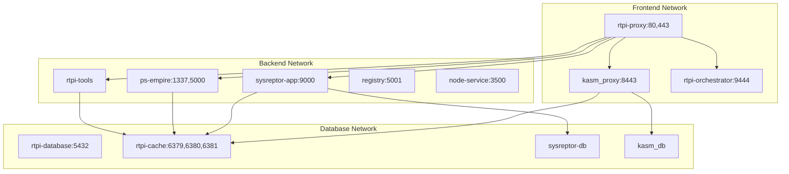

# RTPI-PEN: Red Team Penetration Infrastructure

A comprehensive microservices-based platform for Red Team Penetration Infrastructure, providing security professionals with a complete toolkit for penetration testing, C2 operations, and security assessments.

## 🎯 What's Included

RTPI-PEN provides a pre-configured environment with multiple security-focused services deployed as microservices:

### Core Infrastructure Services
- **🗄️ Database Service** - PostgreSQL with multiple databases (rtpi_main, kasm, sysreptor)
- **⚡ Cache Service** - Redis cluster with multiple instances for different services
- **🐳 Orchestrator Service** - Portainer for container management and orchestration
- **🌐 Proxy Service** - Nginx reverse proxy with SSL termination and unified dashboard
- **🔧 Tools Service** - Containerized security tools (Metasploit, Nmap, Hashcat, etc.)

### Application Services
- **🖥️ Kasm Workspaces** - Browser-based virtual desktops and isolation
- **📊 SysReptor** - Penetration testing documentation and reporting
- **👑 PowerShell Empire** - Command & Control framework
- **📦 Docker Registry** - Local container image registry
- **🌐 Node.js Service** - Additional development/API service

### Pre-installed Security Tools
- **Network Analysis**: Nmap, Wireshark, net-tools
- **Exploitation**: Metasploit, exploitdb, python3-impacket
- **Password Attacks**: Hashcat, Hydra, CrackMapExec
- **Active Directory**: Bloodhound, CrackMapExec, Impacket
- **Web Tools**: Proxychains, curl, wget
- **Development**: PowerShell, Python3, Java, Go, Node.js
- **Windows Tools**: Wine, mingw-w64, PowerSploit, WinPwn
- **Frameworks**: PowerShell Empire, additional C2 tools

## 🏗️ Architecture

### Microservices Architecture


### Network Segmentation
- **rtpi_frontend**: Public-facing services (80, 443, 8443, 9444)
- **rtpi_backend**: Internal application services (isolated)
- **rtpi_database**: Database layer (isolated)
- **kasm_default_network**: Kasm Workspaces internal network
- **sysreptor_default**: SysReptor internal network

## 🚀 Quick Start

### Prerequisites
- Docker 20.10+ and Docker Compose v2
- **Minimum**: 6GB RAM, 4 CPU cores, 15GB disk space
- **Recommended**: 12GB+ RAM, 8+ CPU cores, 30GB+ disk space

### Primary Deployment Method (Recommended)

#### Using Build Script (Easiest)
```bash
# Clone the repository
git clone https://github.com/yourusername/rtpi-pen.git
cd rtpi-pen

# Make build script executable
chmod +x build.sh

# Check system requirements
./build.sh check

# Build all microservices (20-40 minutes)
./build.sh build

# Start the platform
./build.sh start
```

#### Manual Deployment
```bash
# Build all services
docker compose build

# Start all services
docker compose up -d

# Check status
docker compose ps
```

### Legacy Single Container (Available)
```bash
# Access legacy single-container deployment
cd legacy

# Use the legacy build script
chmod +x build-single-image.sh
./build-single-image.sh build
./build-single-image.sh run
```

---

## 🌐 Service Access

### Multi-Container Setup Access (Primary)

| Service | Primary URL | Direct URL | Description |
|---------|-------------|------------|-------------|
| **Main Dashboard** | https://localhost | - | Unified access portal |
| **Portainer** | https://localhost/portainer/ | http://localhost:9444 | Container management |
| **Kasm Workspaces** | https://localhost/kasm/ | https://localhost:8443 | Virtual desktops |
| **SysReptor** | https://localhost/sysreptor/ | http://localhost:9000 | Reporting platform |
| **Empire C2** | https://localhost/empire/ | http://localhost:1337 | Command & Control |
| **Docker Registry** | - | http://localhost:5001 | Local registry |
| **Node.js Service** | - | http://localhost:3500 | Development service |

---

## 🔧 Management & Operations

### Platform Management

#### Using Build Script (Recommended)
```bash
# View platform status
./build.sh status

# View logs for all services
./build.sh logs

# View logs for specific service
./build.sh logs rtpi-tools

# Access shell of specific service
./build.sh shell rtpi-tools

# Stop platform
./build.sh stop

# Restart platform
./build.sh restart

# Update services
./build.sh update

# Complete cleanup (destructive)
./build.sh cleanup
```

#### Manual Docker Compose Commands
```bash
# View all container status
docker compose ps

# View logs for all services
docker compose logs -f

# View logs for specific service
docker compose logs -f rtpi-tools

# Scale specific service
docker compose up -d --scale rtpi-tools=2

# Restart specific service
docker compose restart ps-empire

# Stop all services
docker compose down

# Remove everything including volumes
docker compose down -v
```

### Service-Specific Management

#### Database Service
```bash
# Access database
docker compose exec rtpi-database psql -U rtpi -d rtpi_main

# View database logs
docker compose logs rtpi-database

# Database backup
docker compose exec rtpi-database pg_dump -U rtpi rtpi_main > backup.sql
```

#### Tools Service
```bash
# Access tools container
docker compose exec rtpi-tools /bin/bash

# Run specific tools
docker compose exec rtpi-tools msfconsole
docker compose exec rtpi-tools nmap -h
docker compose exec rtpi-tools hashcat --help
```

#### Cache Service
```bash
# Check cache status
docker compose exec rtpi-cache redis-cli -p 6379 ping
docker compose exec rtpi-cache redis-cli -p 6380 ping
docker compose exec rtpi-cache redis-cli -p 6381 ping

# Monitor cache
docker compose exec rtpi-cache redis-cli -p 6379 monitor
```

---

## 📁 Data Persistence

### Volume Management
- `rtpi_database_data` - Main PostgreSQL data
- `rtpi_cache_data` - Redis cache data  
- `rtpi_orchestrator_data` - Portainer configuration
- `rtpi_tools_data` - Security tools data and configurations
- `sysreptor-app-data` - SysReptor application data
- `sysreptor-db-data` - SysReptor PostgreSQL database
- `kasm_db_1.15.0` - Kasm database and settings
- `empire_data` - Empire C2 framework data
- `registry_data` - Local Docker registry data

### Backup Strategy
```bash
# Backup all volumes
docker run --rm -v rtpi_database_data:/data -v $(pwd):/backup alpine tar czf /backup/database-backup.tar.gz -C /data .

# Restore volumes
docker run --rm -v rtpi_database_data:/data -v $(pwd):/backup alpine tar xzf /backup/database-backup.tar.gz -C /data
```

---

## 🔐 Default Credentials & Configuration

### Database Configuration
- **Main Database**: `rtpi` / `rtpi_secure_password`
- **Kasm Database**: `kasmapp` / `SjenXuTppFFSWIIKjaAJ`
- **SysReptor Database**: `sysreptor` / `sysreptorpassword`

### Cache Configuration  
- **Main Redis (6379)**: `rtpi_redis_password`
- **Kasm Redis (6380)**: `CwoZWGpBk5PZ3zD79fIK`
- **SysReptor Redis (6381)**: `sysreptorredispassword`

### SSL Configuration
- **Certificates**: Auto-generated self-signed certificates
- **Proxy**: SSL termination at nginx reverse proxy
- **Internal**: Services communicate over internal networks

---

## 🛠️ Development & Customization

### Adding Custom Tools
```bash
# Access tools container
docker compose exec rtpi-tools /bin/bash

# Install additional tools
cd /opt/tools/custom
git clone https://github.com/your-custom-tool.git

# Install Python packages
pip3 install your-package

# Install system packages
sudo apt-get update && sudo apt-get install -y your-package
```

### Modifying Services
```bash
# Modify service configuration
nano services/rtpi-proxy/nginx/conf.d/rtpi-pen.conf

# Rebuild specific service
docker compose build rtpi-proxy

# Restart service
docker compose restart rtpi-proxy
```

### Service Development
```bash
# Create new service
mkdir services/my-service
cd services/my-service

# Create Dockerfile
echo "FROM alpine:latest" > Dockerfile

# Add to docker-compose.yml
# Build and start
docker compose build my-service
docker compose up -d my-service
```

---

## 🔍 Troubleshooting

### Platform Won't Start
```bash
# Check system requirements
./build.sh check

# Check service logs
docker compose logs

# Check port conflicts
netstat -tlnp | grep -E '(80|443|1337|5000|8443|9000|9444)'

# Check available resources
docker system df
docker stats --no-stream
```

### Service Not Responding
```bash
# Check specific service status
docker compose ps rtpi-proxy

# Check service logs
docker compose logs rtpi-proxy

# Restart specific service
docker compose restart rtpi-proxy

# Check service health
docker compose exec rtpi-proxy curl -f http://localhost/health
```

### Database Issues
```bash
# Check database connectivity
docker compose exec rtpi-database pg_isready -U rtpi

# Connect to database
docker compose exec rtpi-database psql -U rtpi -d rtpi_main

# Check database logs
docker compose logs rtpi-database
```

### Network Issues
```bash
# Check Docker networks
docker network ls

# Inspect network configuration
docker network inspect rtpi-pen_rtpi_frontend
docker network inspect rtpi-pen_rtpi_backend

# Test service connectivity
docker compose exec rtpi-proxy ping rtpi-database
```

### Performance Issues
```bash
# Check resource usage
docker stats --no-stream

# Check service resource limits
docker compose exec rtpi-tools free -h
docker compose exec rtpi-tools df -h

# Scale problematic services
docker compose up -d --scale rtpi-tools=2
```

---

## 📊 System Requirements

### Minimum Requirements (Multi-Container)
- **RAM**: 6GB
- **CPU**: 4 cores  
- **Disk**: 15GB free space
- **OS**: Linux, macOS, Windows with Docker

### Recommended Requirements
- **RAM**: 12GB+
- **CPU**: 8+ cores
- **Disk**: 30GB+ free space
- **Network**: Stable internet for initial build

### Performance Comparison
| Deployment | RAM Usage | Build Time | Complexity | Scalability |
|------------|-----------|------------|------------|-------------|
| Multi-Container | 6-12GB | 20-40 min | Medium | High |
| Single Container | 4-8GB | 15-30 min | Low | Low |

---

## 🔒 Security Considerations

**⚠️ Important Security Warning**

This platform includes penetration testing tools and frameworks designed for authorized security testing only.

### Security Features
- **Network Segmentation**: Services isolated by function
- **SSL Termination**: Centralized certificate management
- **Access Controls**: Role-based access through Portainer
- **Logging**: Centralized logging for all services
- **Health Monitoring**: Built-in health checks

### Security Best Practices
- **Only use in authorized environments**
- **Isolate from production networks**
- **Change default passwords immediately**
- **Keep containers updated regularly**
- **Monitor service logs for anomalies**
- **Use proper network segmentation**
- **Implement additional firewall rules**

### Network Security
```bash
# View network configuration
docker network ls
docker network inspect rtpi-pen_rtpi_frontend

# Monitor network traffic
docker compose exec rtpi-proxy tail -f /var/log/nginx/access.log

# Update SSL certificates
docker compose exec rtpi-proxy openssl req -x509 -nodes -days 365 -newkey rsa:2048 \
  -keyout /etc/nginx/ssl/rtpi.key -out /etc/nginx/ssl/rtpi.crt
```

---

## 🆘 Support & Contributing

### Getting Help
1. Check the troubleshooting section above
2. Review service logs: `./build.sh logs [service]`
3. Ensure all system requirements are met: `./build.sh check`
4. Verify no port conflicts exist

### Contributing
We welcome contributions! Please:
1. Fork the repository
2. Create a feature branch
3. Test your changes with both deployment methods
4. Submit a pull request with detailed description

### Reporting Issues
When reporting issues, please include:
- Deployment method used (multi-container vs single-container)
- System specifications (OS, RAM, CPU)
- Output of `./build.sh check`
- Service logs and error messages
- Steps to reproduce the issue

### Development Workflow
```bash
# Development setup
git clone <fork-url>
cd rtpi-pen

# Create feature branch
git checkout -b feature/my-feature

# Test changes
./build.sh build
./build.sh start

# Submit PR
git push origin feature/my-feature
```

---

## 📋 Deployment Comparison

| Feature | Multi-Container (Primary) | Single Container (Legacy) |
|---------|---------------------------|---------------------------|
| **Scalability** | ✅ Individual service scaling | ❌ Scale entire stack |
| **Resource Usage** | ✅ Efficient resource allocation | ⚠️ Higher resource usage |
| **Development** | ✅ Service-specific development | ❌ Monolithic development |
| **Maintenance** | ✅ Update individual services | ❌ Update entire container |
| **Complexity** | ⚠️ More complex setup | ✅ Simple setup |
| **Build Time** | ⚠️ 20-40 minutes | ✅ 15-30 minutes |
| **Isolation** | ✅ Network and service isolation | ❌ Single container |
| **Monitoring** | ✅ Per-service monitoring | ⚠️ Monolithic monitoring |

## 📋 License

See the [LICENSE](LICENSE) file for details.

---

**Built for security professionals, by security professionals** 🔴

### Migration Guide
If migrating from single-container to multi-container:
```bash
# Stop single container
cd legacy
./build-single-image.sh stop

# Start multi-container
cd ..
./build.sh start
```

**Note**: Data migration between deployments requires manual export/import of volumes.
