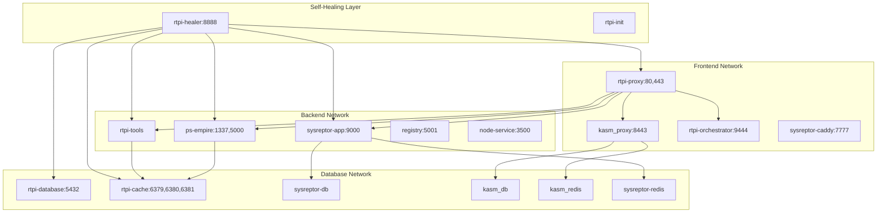

# RTPI-PEN: Red Team Penetration Infrastructure

A comprehensive self-healing microservices-based platform for Red Team Penetration Infrastructure, providing security professionals with a complete toolkit for penetration testing, C2 operations, and security assessments.

## 🎯 What's Included

RTPI-PEN provides a pre-configured environment with multiple security-focused services deployed as microservices with intelligent self-healing capabilities:

### Core Infrastructure Services
- **🏥 Self-Healing Service** - Automated monitoring, repair, and recovery system
- **🗄️ Database Service** - PostgreSQL with multiple databases (rtpi_main, kasm, sysreptor)
- **⚡ Cache Service** - Redis cluster with multiple instances for different services
- **🐳 Orchestrator Service** - Portainer for container management and orchestration
- **🌐 Proxy Service** - Nginx reverse proxy with SSL termination and unified dashboard
- **🔧 Tools Service** - Containerized security tools (Metasploit, Nmap, Hashcat, etc.)

### Application Services
- **🖥️ Kasm Workspaces** - Browser-based virtual desktops and isolation
- **📊 SysReptor** - Penetration testing documentation and reporting
- **👑 PowerShell Empire** - Command & Control framework
- **📦 Docker Registry** - Local container image registry
- **🌐 Node.js Service** - Additional development/API service

### Pre-installed Security Tools
- **Network Analysis**: Nmap, Wireshark, net-tools
- **Exploitation**: Metasploit, exploitdb, python3-impacket
- **Password Attacks**: Hashcat, Hydra, CrackMapExec
- **Active Directory**: Bloodhound, CrackMapExec, Impacket
- **Web Tools**: Proxychains, curl, wget
- **Development**: PowerShell, Python3, Java, Go, Node.js
- **Windows Tools**: Wine, mingw-w64, PowerSploit, WinPwn
- **Frameworks**: PowerShell Empire, additional C2 tools

## 🏗️ Architecture

### Self-Healing Microservices Architecture


### Network Segmentation
- **rtpi_frontend**: Public-facing services (80, 443, 8443, 9444, 7777)
- **rtpi_backend**: Internal application services (isolated)
- **rtpi_database**: Database layer (isolated)
- **kasm_default_network**: Kasm Workspaces internal network
- **sysreptor_default**: SysReptor internal network

## 🚀 Quick Start

### Prerequisites
- Docker 20.10+ and Docker Compose v2
- **For Self-Healing Deployment**: Root access (sudo)
- **Minimum**: 6GB RAM, 4 CPU cores, 15GB disk space
- **Recommended**: 12GB+ RAM, 8+ CPU cores, 30GB+ disk space

### Deployment Methods

RTPI-PEN offers three deployment methods, each with different capabilities:

## 🏥 Method 1: Self-Healing Deployment (Most Advanced)

The self-healing deployment provides automated monitoring, issue detection, and recovery capabilities.

### Features:
- **Automatic Issue Resolution**: Detects and repairs common deployment issues
- **Intelligent Container Restart**: Smart backoff and restart strategies
- **Configuration Auto-Repair**: Regenerates corrupted configuration files
- **Permission Healing**: Automatically fixes permission issues
- **Database Connectivity Healing**: Resolves database connection problems
- **Real-time Monitoring**: Continuous health monitoring with API endpoints
- **Automated Backup**: Automatic backup and recovery capabilities

### Usage:
```bash
# Clone the repository
git clone https://github.com/attck-nexus/rtpi-pen.git
cd rtpi-pen

# Make deploy script executable
chmod +x deploy-self-healing.sh

# Full deployment with self-healing (requires root)
sudo ./deploy-self-healing.sh

# Alternative deployment commands
sudo ./deploy-self-healing.sh --help     # Show all options
sudo ./deploy-self-healing.sh --stop     # Stop all services
sudo ./deploy-self-healing.sh --restart  # Restart all services
sudo ./deploy-self-healing.sh --clean    # Clean up everything
sudo ./deploy-self-healing.sh --verify   # Verify deployment status
```

## 🔧 Method 2: Standard Multi-Container (Primary)

The standard multi-container deployment using the build script for regular operations.

### Usage:
```bash
# Make build script executable
chmod +x build.sh

# Check system requirements
./build.sh check

# Build all microservices (20-40 minutes)
./build.sh build

# Start the platform
./build.sh start
```

### Management Commands:
```bash
./build.sh status    # View service status and resource usage
./build.sh logs      # View logs for all services
./build.sh logs [service]  # View logs for specific service
./build.sh shell [service] # Access shell of specific service
./build.sh stop      # Stop all services
./build.sh restart   # Restart all services
./build.sh update    # Update and rebuild services
./build.sh cleanup   # Remove everything (destructive)
```

## 🐳 Method 3: Legacy Single Container (Available)

The legacy single-container deployment for simpler setups.

### Usage:
```bash
# Access legacy single-container deployment
cd legacy

# Use the legacy build script
chmod +x build-single-image.sh
./build-single-image.sh build
./build-single-image.sh run
```

---

## 🌐 Service Access

### Self-Healing Deployment Access

| Service | Primary URL | Direct URL | Description |
|---------|-------------|------------|-------------|
| **Self-Healing Dashboard** | - | http://localhost:8888/health | Monitoring and health status |
| **Main Dashboard** | https://localhost | - | Unified access portal |
| **Portainer** | https://localhost/portainer/ | http://localhost:9444 | Container management |
| **Kasm Workspaces** | https://localhost/kasm/ | https://localhost:8443 | Virtual desktops |
| **SysReptor** | https://localhost/sysreptor/ | http://localhost:7777 | Reporting platform |
| **Empire C2** | https://localhost/empire/ | http://localhost:1337 | Command & Control |
| **Docker Registry** | - | http://localhost:5001 | Local registry |
| **Node.js Service** | - | http://localhost:3500 | Development service |

### Standard Multi-Container Access

| Service | Primary URL | Direct URL | Description |
|---------|-------------|------------|-------------|
| **Main Dashboard** | https://localhost | - | Unified access portal |
| **Portainer** | https://localhost/portainer/ | http://localhost:9444 | Container management |
| **Kasm Workspaces** | https://localhost/kasm/ | https://localhost:8443 | Virtual desktops |
| **SysReptor** | https://localhost/sysreptor/ | http://localhost:9000 | Reporting platform |
| **Empire C2** | https://localhost/empire/ | http://localhost:1337 | Command & Control |
| **Docker Registry** | - | http://localhost:5001 | Local registry |
| **Node.js Service** | - | http://localhost:3500 | Development service |

---

## 🔧 Management & Operations

### Self-Healing Deployment Management

#### Primary Commands:
```bash
# Check deployment status
sudo ./deploy-self-healing.sh --verify

# View self-healing service logs
docker compose logs -f rtpi-healer

# Check health monitoring API
curl http://localhost:8888/health

# Stop all services
sudo ./deploy-self-healing.sh --stop

# Restart all services
sudo ./deploy-self-healing.sh --restart

# Complete cleanup (destructive)
sudo ./deploy-self-healing.sh --clean
```

#### Monitoring Commands:
```bash
# Monitor self-healing service
docker compose logs -f rtpi-healer

# Check container health
docker ps --format "table {{.Names}}\t{{.Status}}\t{{.Ports}}"

# View resource usage
docker stats --no-stream

# Check service health endpoints
curl http://localhost:8888/health
curl http://localhost:9000/health
curl http://localhost:9444/api/status
```

### Standard Multi-Container Management

#### Build Script Commands:
```bash
# View platform status
./build.sh status

# View logs for all services
./build.sh logs

# View logs for specific service
./build.sh logs rtpi-tools

# Access shell of specific service
./build.sh shell rtpi-tools

# Stop platform
./build.sh stop

# Restart platform
./build.sh restart

# Update services
./build.sh update

# Complete cleanup (destructive)
./build.sh cleanup
```

#### Manual Docker Compose Commands:
```bash
# View all container status
docker compose ps

# View logs for all services
docker compose logs -f

# View logs for specific service
docker compose logs -f rtpi-tools

# Scale specific service
docker compose up -d --scale rtpi-tools=2

# Restart specific service
docker compose restart ps-empire

# Stop all services
docker compose down

# Remove everything including volumes
docker compose down -v
```

### Service-Specific Management

#### Self-Healing Service:
```bash
# Access healer container
docker compose exec rtpi-healer /bin/bash

# View healer configuration
docker compose exec rtpi-healer cat /opt/rtpi-healer/scripts/healer.py

# Monitor healer activity
docker compose logs -f rtpi-healer
```

#### Database Service:
```bash
# Access database
docker compose exec rtpi-database psql -U rtpi -d rtpi_main

# View database logs
docker compose logs rtpi-database

# Database backup
docker compose exec rtpi-database pg_dump -U rtpi rtpi_main > backup.sql
```

#### Tools Service:
```bash
# Access tools container
docker compose exec rtpi-tools /bin/bash

# Run specific tools
docker compose exec rtpi-tools msfconsole
docker compose exec rtpi-tools nmap -h
docker compose exec rtpi-tools hashcat --help
```

#### Cache Service:
```bash
# Check cache status
docker compose exec rtpi-cache redis-cli -p 6379 ping
docker compose exec rtpi-cache redis-cli -p 6380 ping
docker compose exec rtpi-cache redis-cli -p 6381 ping

# Monitor cache
docker compose exec rtpi-cache redis-cli -p 6379 monitor
```

---

## 📁 Data Persistence

### Volume Management
- `rtpi_database_data` - Main PostgreSQL data
- `rtpi_cache_data` - Redis cache data  
- `rtpi_orchestrator_data` - Portainer configuration
- `rtpi_tools_data` - Security tools data and configurations
- `rtpi_healer_data` - Self-healing service data and configurations
- `sysreptor-app-data` - SysReptor application data
- `sysreptor-db-data` - SysReptor PostgreSQL database
- `sysreptor-caddy-data` - Caddy proxy data
- `kasm_db_1.15.0` - Kasm database and settings
- `empire_data` - Empire C2 framework data
- `registry_data` - Local Docker registry data

### Backup Strategy
```bash
# Backup all volumes
docker run --rm -v rtpi_database_data:/data -v $(pwd):/backup alpine tar czf /backup/database-backup.tar.gz -C /data .

# Backup healer data
docker run --rm -v rtpi_healer_data:/data -v $(pwd):/backup alpine tar czf /backup/healer-backup.tar.gz -C /data .

# Restore volumes
docker run --rm -v rtpi_database_data:/data -v $(pwd):/backup alpine tar xzf /backup/database-backup.tar.gz -C /data
```

---

## 🔐 Default Credentials & Configuration

### Database Configuration
- **Main Database**: `rtpi` / `rtpi_secure_password`
- **Kasm Database**: `kasmapp` / `SjenXuTppFFSWIIKjaAJ`
- **SysReptor Database**: `sysreptor` / `sysreptorpassword`

### Cache Configuration  
- **Main Redis (6379)**: `rtpi_redis_password`
- **Kasm Redis (6380)**: `CwoZWGpBk5PZ3zD79fIK`
- **SysReptor Redis (6381)**: `sysreptorredispassword`

### Self-Healing Configuration
- **Healer API**: http://localhost:8888/health
- **Monitoring Interval**: 30 seconds
- **Restart Policy**: Intelligent backoff (30s, 60s, 120s, 300s)
- **Health Check Timeout**: 10 seconds

### SSL Configuration
- **Certificates**: Auto-generated self-signed certificates
- **Proxy**: SSL termination at nginx reverse proxy
- **Internal**: Services communicate over internal networks

---

## 🛠️ Development & Customization

### Adding Custom Tools
```bash
# Access tools container
docker compose exec rtpi-tools /bin/bash

# Install additional tools
cd /opt/tools/custom
git clone https://github.com/your-custom-tool.git

# Install Python packages
pip3 install your-package

# Install system packages
sudo apt-get update && sudo apt-get install -y your-package
```

### Modifying Self-Healing Behavior
```bash
# Edit healer script
nano services/rtpi-healer/scripts/healer.py

# Rebuild healer service
docker compose build rtpi-healer

# Restart healer service
docker compose restart rtpi-healer
```

### Modifying Services
```bash
# Modify service configuration
nano services/rtpi-proxy/nginx/conf.d/rtpi-pen.conf

# Rebuild specific service
docker compose build rtpi-proxy

# Restart service
docker compose restart rtpi-proxy
```

### Service Development
```bash
# Create new service
mkdir services/my-service
cd services/my-service

# Create Dockerfile
echo "FROM alpine:latest" > Dockerfile

# Add to docker-compose.yml
# Build and start
docker compose build my-service
docker compose up -d my-service
```

---

## 🔍 Troubleshooting

### Self-Healing Deployment Issues

#### Check Self-Healing Status:
```bash
# Check healer service status
docker compose ps rtpi-healer

# View healer logs
docker compose logs -f rtpi-healer

# Check health API
curl http://localhost:8888/health

# Verify healer permissions
docker compose exec rtpi-healer ls -la /var/run/docker.sock
```

#### Common Self-Healing Fixes:
```bash
# Force healer restart
docker compose restart rtpi-healer

# Rebuild healer service
docker compose build rtpi-healer
docker compose up -d rtpi-healer

# Check Docker socket permissions
ls -la /var/run/docker.sock
```

### Platform Won't Start
```bash
# Check system requirements
./build.sh check  # or sudo ./deploy-self-healing.sh --verify

# Check service logs
docker compose logs

# Check port conflicts
netstat -tlnp | grep -E '(80|443|1337|5000|8443|9000|9444|8888)'

# Check available resources
docker system df
docker stats --no-stream
```

### Service Not Responding
```bash
# Check specific service status
docker compose ps rtpi-proxy

# Check service logs
docker compose logs rtpi-proxy

# Restart specific service
docker compose restart rtpi-proxy

# Check service health
docker compose exec rtpi-proxy curl -f http://localhost/health
```

### Database Issues
```bash
# Check database connectivity
docker compose exec rtpi-database pg_isready -U rtpi

# Connect to database
docker compose exec rtpi-database psql -U rtpi -d rtpi_main

# Check database logs
docker compose logs rtpi-database

# Check healer database monitoring
docker compose logs rtpi-healer | grep -i database
```

### Network Issues
```bash
# Check Docker networks
docker network ls

# Inspect network configuration
docker network inspect rtpi-pen_rtpi_frontend
docker network inspect rtpi-pen_rtpi_backend

# Test service connectivity
docker compose exec rtpi-proxy ping rtpi-database

# Check healer network monitoring
docker compose logs rtpi-healer | grep -i network
```

### Self-Healing Service Issues
```bash
# Check healer service health
curl -v http://localhost:8888/health

# View healer service logs
docker compose logs -f rtpi-healer

# Check healer container permissions
docker compose exec rtpi-healer id
docker compose exec rtpi-healer docker ps

# Restart healer service
docker compose restart rtpi-healer
```

### Performance Issues
```bash
# Check resource usage
docker stats --no-stream

# Check service resource limits
docker compose exec rtpi-tools free -h
docker compose exec rtpi-tools df -h

# Scale problematic services
docker compose up -d --scale rtpi-tools=2

# Check healer performance monitoring
docker compose logs rtpi-healer | grep -i performance
```

---

## 📊 System Requirements

### Minimum Requirements

| Deployment Method | RAM | CPU | Disk | Build Time |
|-------------------|-----|-----|------|------------|
| Self-Healing | 8GB | 4 cores | 20GB | 25-45 min |
| Multi-Container | 6GB | 4 cores | 15GB | 20-40 min |
| Single Container | 4GB | 2 cores | 10GB | 15-30 min |

### Recommended Requirements

| Deployment Method | RAM | CPU | Disk | Features |
|-------------------|-----|-----|------|----------|
| Self-Healing | 16GB+ | 8+ cores | 40GB+ | Full automation, monitoring |
| Multi-Container | 12GB+ | 8+ cores | 30GB+ | High performance, scalability |
| Single Container | 8GB+ | 4+ cores | 20GB+ | Basic functionality |

### Performance Comparison

| Feature | Self-Healing | Multi-Container | Single Container |
|---------|--------------|-----------------|------------------|
| **Scalability** | ✅ Auto-scaling | ✅ Manual scaling | ❌ Fixed scaling |
| **Monitoring** | ✅ Comprehensive | ⚠️ Basic | ❌ Limited |
| **Auto-Recovery** | ✅ Intelligent | ❌ Manual | ❌ Manual |
| **Complexity** | ⚠️ High | ⚠️ Medium | ✅ Low |
| **Maintenance** | ✅ Automated | ⚠️ Manual | ⚠️ Manual |
| **Resource Usage** | ⚠️ Higher | ⚠️ Medium | ✅ Lower |
| **Development** | ✅ Advanced | ✅ Good | ❌ Basic |

---

## 🔒 Security Considerations

**⚠️ Important Security Warning**

This platform includes penetration testing tools and frameworks designed for authorized security testing only.

### Security Features
- **Network Segmentation**: Services isolated by function
- **SSL Termination**: Centralized certificate management
- **Access Controls**: Role-based access through Portainer
- **Logging**: Centralized logging for all services
- **Health Monitoring**: Built-in health checks and monitoring
- **Self-Healing**: Automated security policy enforcement
- **Container Isolation**: Strict container isolation and resource limits

### Security Best Practices
- **Only use in authorized environments**
- **Isolate from production networks**
- **Change default passwords immediately**
- **Keep containers updated regularly**
- **Monitor service logs for anomalies**
- **Use proper network segmentation**
- **Implement additional firewall rules**
- **Monitor self-healing service logs**
- **Regularly check health endpoints**

### Network Security
```bash
# View network configuration
docker network ls
docker network inspect rtpi-pen_rtpi_frontend

# Monitor network traffic
docker compose exec rtpi-proxy tail -f /var/log/nginx/access.log

# Check healer network monitoring
docker compose logs rtpi-healer | grep -i network

# Update SSL certificates
docker compose exec rtpi-proxy openssl req -x509 -nodes -days 365 -newkey rsa:2048 \
  -keyout /etc/nginx/ssl/rtpi.key -out /etc/nginx/ssl/rtpi.crt
```

---

## 🆘 Support & Contributing

### Getting Help
1. Check the troubleshooting section above
2. Review service logs: `docker compose logs [service]`
3. For self-healing deployment: Check `curl http://localhost:8888/health`
4. Ensure all system requirements are met
5. Verify no port conflicts exist

### Contributing
We welcome contributions! Please:
1. Fork the repository
2. Create a feature branch
3. Test your changes with all deployment methods
4. Submit a pull request with detailed description

### Reporting Issues
When reporting issues, please include:
- Deployment method used (self-healing, multi-container, or single-container)
- System specifications (OS, RAM, CPU)
- Output of health checks and logs
- Steps to reproduce the issue

### Development Workflow
```bash
# Development setup
git clone <fork-url>
cd rtpi-pen

# Create feature branch
git checkout -b feature/my-feature

# Test with self-healing deployment
sudo ./deploy-self-healing.sh

# Test with standard deployment
./build.sh build && ./build.sh start

# Submit PR
git push origin feature/my-feature
```

---

## 📋 Deployment Method Comparison

| Feature | Self-Healing | Multi-Container | Single Container |
|---------|--------------|-----------------|------------------|
| **Auto-Recovery** | ✅ Intelligent healing | ❌ Manual recovery | ❌ Manual recovery |
| **Monitoring** | ✅ Real-time dashboard | ⚠️ Basic monitoring | ❌ Limited monitoring |
| **Scalability** | ✅ Auto-scaling | ✅ Manual scaling | ❌ Fixed scaling |
| **Resource Usage** | ⚠️ Higher (8GB+) | ⚠️ Medium (6GB+) | ✅ Lower (4GB+) |
| **Development** | ✅ Advanced features | ✅ Good flexibility | ❌ Basic functionality |
| **Maintenance** | ✅ Automated | ⚠️ Manual | ⚠️ Manual |
| **Setup Time** | ⚠️ 25-45 minutes | ⚠️ 20-40 minutes | ✅ 15-30 minutes |
| **Complexity** | ⚠️ High | ⚠️ Medium | ✅ Low |
| **Root Required** | ✅ Yes | ❌ No | ❌ No |

### Migration Guide
If migrating from single-container to multi-container:
```bash
# Stop single container
cd legacy
./build-single-image.sh stop

# Start multi-container
cd ..
./build.sh start
```

If migrating to self-healing deployment:
```bash
# Stop current deployment
docker compose down

# Start self-healing deployment
sudo ./deploy-self-healing.sh
```

**Note**: Data migration between deployments requires manual export/import of volumes.

---

## 📋 License

See the [LICENSE](LICENSE) file for details.

---

**Built for security professionals, by security professionals** 🔴

### Quick Reference Commands

#### Self-Healing Deployment:
```bash
sudo ./deploy-self-healing.sh          # Deploy with self-healing
sudo ./deploy-self-healing.sh --verify # Check status
curl http://localhost:8888/health       # Health check
```

#### Standard Deployment:
```bash
./build.sh build && ./build.sh start   # Build and start
./build.sh status                       # Check status
./build.sh logs [service]              # View logs
```

#### Legacy Deployment:
```bash
cd legacy && ./build-single-image.sh build && ./build-single-image.sh run
```

**For detailed documentation, troubleshooting, and advanced configurations, refer to the sections above.**
