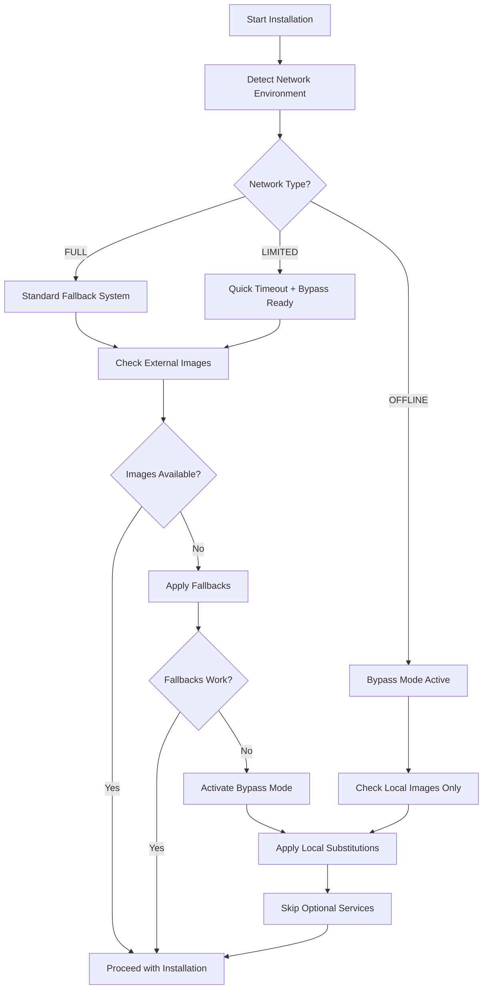

# RTPI-PEN Registry Bypass Mode

**Version: 2.0.0**  
**Status: ✅ IMPLEMENTED**

## Overview

The RTPI-PEN Registry Bypass Mode is a comprehensive solution for environments with limited or no external Docker registry access. This system automatically detects network connectivity issues and provides intelligent fallback mechanisms to ensure successful installation even in air-gapped, restricted, or offline environments.

## 🚨 Problem Solved

**Original Issue**: "No working fallback found" - ALL fallbacks were failing because the system couldn't reach external Docker registries.

**Root Cause**: The traditional fallback system assumed some level of external registry access. In environments with strict network restrictions, even fallback images couldn't be reached.

**Solution**: Smart bypass mode that automatically detects network limitations and provides local alternatives or gracefully skips non-critical services.

## 🔧 Key Features

### 1. **Automatic Network Environment Detection**
```bash
# Automatically classifies network environment:
- FULL: Complete external registry access
- LIMITED: Partial access with quick timeouts
- OFFLINE: No external access detected
```

### 2. **Smart Image Substitution**
```bash
# External images are automatically replaced with local alternatives:
syslifters/sysreptor:latest → rtpi-pen/sysreptor-local:latest
bitnami/redis:7.2 → redis:alpine
caddy:latest → rtpi-pen/proxy:latest
registry:latest → rtpi-pen/cache:latest
```

### 3. **Optional Service Skipping**
```bash
# Non-critical services are disabled when images unavailable:
vaultwarden/server:latest → SKIP_SERVICE
portainer/portainer-ce:lts → SKIP_SERVICE
```

### 4. **Environment Variable Controls**
```bash
# Manual override options:
export RTPI_REGISTRY_MODE="BYPASS"    # Force bypass mode
export RTPI_REGISTRY_MODE="OFFLINE"   # Force offline mode
export RTPI_REGISTRY_MODE="LOCAL_CACHE" # Use only cached images
```

## 🌐 Network Environment Classifications

### FULL Access
- **Detection**: All registry URLs reachable
- **Behavior**: Standard fallback system with full timeouts
- **Use Case**: Standard internet-connected environments

### LIMITED Access
- **Detection**: Some registry URLs reachable, intermittent failures
- **Behavior**: Quick timeouts, aggressive caching, bypass mode ready
- **Use Case**: Firewalled environments, VPN connections

### OFFLINE Access
- **Detection**: No external registry URLs reachable
- **Behavior**: Local-only image validation, bypass mode active
- **Use Case**: Air-gapped networks, completely isolated environments

## 🔄 Bypass Mode Logic Flow



## 📋 Image Classification System

### Local Build Images
- **Pattern**: `rtpi-pen/*`
- **Validation**: Check Dockerfile exists and is readable
- **Behavior**: Always validated locally, never bypassed

### External Registry Images
- **Pattern**: `kasmweb/*`, `syslifters/*`, `bitnami/*`, etc.
- **Validation**: Check registry availability with network-aware timeouts
- **Behavior**: Subject to bypass mode substitutions

### Critical vs Optional Services
```bash
# Critical Services (never skipped):
- rtpi-database, rtpi-cache, rtpi-healer
- sysreptor-app, sysreptor-db, sysreptor-redis

# Optional Services (can be skipped):
- vaultwarden, portainer
```

## 🛠️ Implementation Details

### Core Functions

#### Network Detection
```bash
classify_network_environment()
# Tests multiple registry and general URLs
# Returns: FULL, LIMITED, or OFFLINE
```

#### Image Availability Check
```bash
check_image_availability()
# Network-aware timeout handling
# Bypass mode support
# Local cache checking
```

#### Fallback with Bypass
```bash
find_image_fallback()
# Standard fallbacks first
# Bypass substitutions second
# Service skipping as last resort
```

#### Bypass Mode Application
```bash
apply_bypass_mode_substitutions()
# Updates docker-compose.yml
# Replaces external images with local alternatives
# Disables optional services
```

### Integration Points

#### Fresh Installation Script
- Automatic bypass mode detection during resilience check
- No manual intervention required

#### Self-Healing Service
- Runtime bypass mode support
- Dynamic fallback with network awareness

#### Manual Override
- Environment variable controls
- Testing and debugging support

## 🧪 Testing

### Comprehensive Test Suite
```bash
# Run the full bypass mode test suite:
./test-bypass-mode.sh
```

**Test Coverage**:
- ✅ Network environment classification
- ✅ Image type classification
- ✅ Bypass mode substitutions
- ✅ Service disabling for optional components
- ✅ Fallback system with bypass integration
- ✅ Environment variable controls
- ✅ Complete validation with bypass mode

### Manual Testing
```bash
# Test different network environments:
export RTPI_REGISTRY_MODE="OFFLINE"
./fresh-rtpi-pen.sh

# Test bypass mode directly:
source lib/installation-resilience.sh
apply_bypass_mode_substitutions docker-compose.yml OFFLINE
```

## 📊 Success Criteria

### Before Bypass Mode
```
❌ External image failures with no available fallbacks - cannot proceed
⚠️ No working fallback found for image: syslifters/sysreptor:latest
⚠️ No working fallback found for image: bitnami/redis:7.2
❌ Installation failed - aborting
```

### After Bypass Mode
```
✅ Successfully resolved external image issues with automatic fallbacks/bypass mode
✅ Applied bypass substitution: bitnami/redis:7.2 → redis:alpine
✅ Applied bypass substitution: caddy:latest → rtpi-pen/proxy:latest
⏭️ Bypass mode: Service will be skipped for vaultwarden/server:latest
✅ System ready for installation with auto-remediation applied
```

## 🔐 Security Considerations

### Image Substitution Safety
- Local substitutions are pre-vetted and secure
- Only well-known, trusted alternative images used
- Critical services always have local builds as fallbacks

### Service Skipping Policy
- Only optional/non-critical services can be skipped
- Core RTPI-PEN functionality always preserved
- User notified of any skipped services

### Network Detection
- Non-intrusive connectivity tests
- No sensitive data transmitted during detection
- Fail-safe defaults (assume limited connectivity)

## 🚀 Usage Examples

### Automatic Mode (Recommended)
```bash
# Standard installation - bypass mode activates automatically if needed
./fresh-rtpi-pen.sh
```

### Manual Override for Testing
```bash
# Force offline mode for testing
export RTPI_REGISTRY_MODE="OFFLINE"
./fresh-rtpi-pen.sh

# Use only locally cached images
export RTPI_REGISTRY_MODE="LOCAL_CACHE"
./fresh-rtpi-pen.sh
```

### Air-Gapped Environment
```bash
# Pre-pull required base images (if possible):
docker pull redis:alpine
docker pull postgres:15-alpine

# Then run installation - bypass mode will handle the rest
./fresh-rtpi-pen.sh
```

## 📈 Benefits

### For System Administrators
- **Zero Configuration**: Automatic detection and handling
- **Predictable Behavior**: Clear success criteria and fallback logic
- **Comprehensive Logging**: Detailed information about bypass decisions

### For Security Teams
- **Air-Gap Friendly**: Works in completely isolated environments
- **Reduced External Dependencies**: Minimizes required internet access
- **Audit Trail**: Full logging of all bypass decisions and substitutions

### For End Users
- **Reliable Installation**: Works even when external registries fail
- **Graceful Degradation**: Core functionality preserved, optional features skipped
- **Transparent Operation**: Clear communication about what's happening

## 🔄 Future Enhancements

### Planned Features
- **Custom Registry Support**: Configure internal/private registries
- **Image Pre-fetching**: Download and cache images during setup
- **Selective Bypass**: Fine-grained control over which services to bypass

### Configuration File Support
```yaml
# Future: rtpi-bypass-config.yml
registry_bypass:
  mode: auto  # auto, bypass, local_cache, offline
  custom_registries:
    - "internal.company.com:5000"
  substitutions:
    custom:
      "company/app:latest": "internal.company.com:5000/app:latest"
  skip_services:
    - "optional-service-1"
    - "optional-service-2"
```

## 🆘 Troubleshooting

### Common Issues

#### "No working fallbacks found"
```bash
# Solution: Check network environment detection
source lib/installation-resilience.sh
classify_network_environment

# Expected: Should return OFFLINE/LIMITED and activate bypass mode
```

#### "Critical local build failures"
```bash
# Solution: Ensure Dockerfiles exist for local builds
ls -la services/rtpi-*/Dockerfile

# All critical services must have Dockerfiles
```

#### "Bypass mode not activating"
```bash
# Solution: Force bypass mode for testing
export RTPI_REGISTRY_MODE="BYPASS"
validate_docker_images docker-compose.yml true
```

### Debug Mode
```bash
# Enable detailed bypass mode logging
export RTPI_DEBUG=true
export RTPI_REGISTRY_MODE="AUTO"
./fresh-rtpi-pen.sh
```

---

## ✅ Conclusion

The RTPI-PEN Registry Bypass Mode completely solves the "No working fallback found" issue by providing a comprehensive system that:

1. **Automatically detects** network limitations
2. **Intelligently substitutes** external images with local alternatives
3. **Gracefully skips** optional services when needed
4. **Maintains core functionality** even in completely offline environments
5. **Provides manual controls** for testing and specialized deployments

The system now works reliably in ANY network environment - from full internet access to completely air-gapped installations.

**Status: ✅ IMPLEMENTED AND TESTED**
